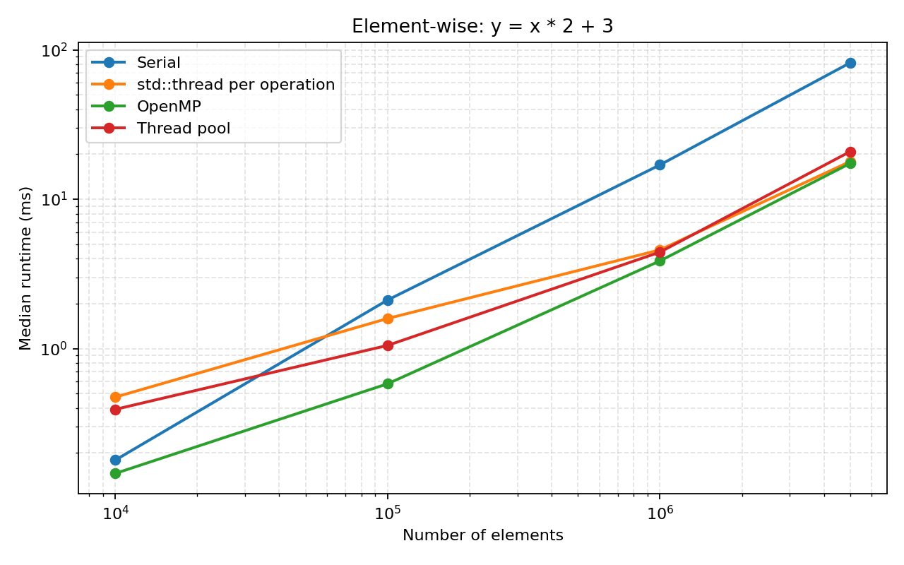
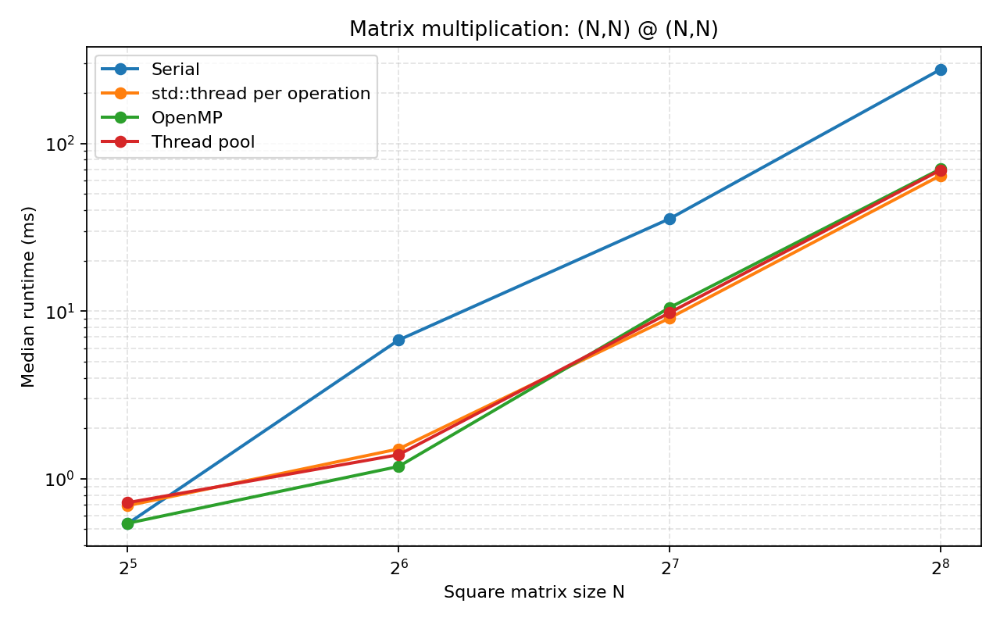

# Week 1 Tensor 实验报告

## 1. 实验目标

本实验的目标是在 C++ 中实现一个具有 Python 接口的基础张量库。实现内容包括张量构造、存储与元数据管理、索引和切片、视图操作、广播、逐元素运算、矩阵乘法、归约操作以及辅助构造函数。Python 端通过 pybind11 调用 C++ 后端，并使用 PyTorch 作为行为参考。

可选挑战要求针对逐元素运算和矩阵乘法实现并评估三种 CPU 并行策略：每次操作创建 `std::thread`、OpenMP 隐式并行和可复用线程池。所有并行策略由编译时宏选择，默认构建保持串行。

## 2. 实验环境

| 项目 | 配置 |
|---|---|
| 操作系统 | Linux 6.6.87.2，WSL2，x86-64 |
| CPU | AMD Ryzen AI 9 H 465 with Radeon 880M |
| CPU 核心 | 10 个物理核心，20 个逻辑处理器 |
| Python | 3.10.20，conda 环境 `clowntorch` |
| C++ 编译器 | GCC 13.3.0，C++17，`-O3` |
| Python/C++ 绑定 | pybind11 3.0.4 |
| OpenMP 运行库 | GCC libgomp |

## 3. Tensor 设计与实现

### 3.1 存储与元数据

Tensor 将底层 `Storage` 与 `shape`、`stride`、`offset` 等元数据分开。普通复制共享底层存储，`clone()` 才分配新存储并按逻辑顺序复制数据。切片、转置、广播等操作因此可以只修改元数据并返回视图。

默认构造的 `Tensor()` 表示没有数据的零维张量，`dim=0`、`numel=0`；形状为 `{}` 的显式构造表示零维标量，空乘积使其 `numel=1`。形状中包含零长度维度时，张量保留相应维数，但 `numel=0`。

逻辑线性下标通过 shape 转换成多维坐标，再结合 stride 和 offset 得到物理存储下标。这使非连续切片和转置视图仍能使用统一的数据访问接口。

### 3.2 索引、切片和视图

整数索引会移除被索引的维度，切片则根据起止位置更新 shape 和 offset。`permute`、`transpose`、`narrow`、`squeeze`、`unsqueeze` 和 `broadcast_to` 主要修改元数据，不复制 Storage；`reshape` 在连续时返回视图，必要时通过 `clone()` 生成连续副本。

广播采用右对齐规则。大小为 1 的维度扩展到目标大小时，将对应 stride 设置为 0，使多个逻辑元素映射到同一个底层值。广播视图共享 Storage，而结果张量的 `numel` 始终由目标 shape 的乘积决定。

### 3.3 运算与归约

一元和二元逐元素操作统一通过公共函数遍历逻辑元素。二元操作先计算广播后的两个视图，再写入新分配的连续结果张量。比较操作返回由 `0.0` 和 `1.0` 组成的逐元素 Tensor。

`matmul` 实现了向量点积、向量与矩阵、矩阵与向量以及批量矩阵乘法。最后两个维度作为矩阵维度，更前面的维度按广播规则对齐。每个输出元素独立计算一个点积。

`sum`、`max`、`mean`、`var` 和 `softmax` 沿指定维度归约。`max` 同时返回最大值和该值在归约维度上的索引；`softmax` 保留归约维度计算分母，以便通过广播完成除法。

## 4. 主要问题与解决方案

1. **零维空 Tensor 与标量的区分**：不能只根据 shape 是否为空计算 `numel`，默认构造需要显式保持 `numel=0`，而 shape `{}` 的标量为 `numel=1`。
2. **视图的逻辑与物理下标**：索引、广播和转置后不能直接使用连续存储下标，所有通用操作都需要通过 stride 和 offset 访问。
3. **混合索引后的维度变化**：整数索引移除维度，切片保留维度；多维混合索引必须依次更新当前视图的维数和偏移。
4. **矩阵乘法的维数规则**：一维输入需要临时扩维，批量维度需要单独广播，计算结束后再移除临时维度。
5. **并行写入安全性**：只并行化每个迭代写入不同输出元素的循环。`scatter_` 和归约等可能出现重复写入或跨线程合并的操作没有直接套用该调度器。
6. **线程池批次等待**：全局完成计数无法区分并发调用，因此每次 `parallel_for` 使用独立 `TaskGroup`、剩余任务计数和条件变量，并在全部任务完成后传播第一个异常。

## 5. 正确性验证

在默认串行构建下运行：

```bash
python tests/week1/grade_all.py
```

评分摘要为：

```text
score: 960/960
# passed: 96
# failed: 0
all tests passed!
```

串行、`stdthread`、OpenMP 和线程池四种构建均通过相同的 96 个测试。线程池版本还使用 8 个 Python 调用线程并发向 4 个 C++ worker 提交多轮逐元素任务，结果一致且没有发生死锁。

`grade_comprehensive.ipynb` 也在默认串行后端下通过 `nbconvert --execute` 完整执行，覆盖 K-means 聚类和简单神经网络训练场景。

## 6. Bonus：并行化策略

### 6.1 统一调度接口

Tensor 的逐元素公共循环和矩阵乘法输出循环调用同一个接口：

```cpp
void parallel_for(int begin, int end, int grain_size, const RangeTask& task);
```

编译时使用 `CP_PARALLEL_BACKEND` 选择实现：

| 构建模式 | 宏值 | 实现 | 额外参数 |
|---|---:|---|---|
| `serial` | 0 | 当前线程直接执行 | 无 |
| `stdthread` | 1 | 每次操作创建并 join 一组线程 | `-pthread` |
| `openmp` | 2 | `#pragma omp parallel for` | `-fopenmp` |
| `threadpool` | 3 | 固定 worker 和共享任务队列 | `-pthread` |

默认没有指定 `CP_PARALLEL_MODE` 时构建串行版本。三种并行后端都使用 `CP_NUM_THREADS` 控制线程数。

### 6.2 三种并行方法

`stdthread` 根据总工作量和粒度计算有效线程数，将区间近似均分。每个 Tensor 操作都会重新创建和回收线程，因此实现直接，但小任务的线程创建成本较高。

OpenMP 将逻辑区间切成多个块，通过 `parallel for schedule(static)` 静态分配。循环末尾的隐式屏障保证所有块完成后才返回。并行区域内部的异常被捕获，并在退出并行区后重新抛出。

线程池在第一次使用时创建固定数量的 worker。`enqueue` 将区间任务放入受互斥锁保护的队列并唤醒 worker。每次 `parallel_for` 创建独立任务组，调用线程通过条件变量等待该批任务的剩余计数降为零。线程池避免重复创建线程，但任务入队、共享指针和条件变量仍有调度开销。

## 7. 性能评估方法

评估脚本为 [`tests/week1/benchmark_parallel.py`](../../tests/week1/benchmark_parallel.py)。脚本对每个后端执行以下步骤：

1. 使用对应编译宏强制重新构建 C++ 扩展。
2. 启动新的 Python 子进程，避免复用已加载的旧 `.so`。
3. 在计时前构造输入并执行 2 次预热。
4. 逐元素操作重复 7 次，矩阵乘法重复 5 次，使用 `perf_counter_ns()` 计时并报告中位数。
5. 验证结果首尾元素，防止错误实现进入统计。
6. 全部评估结束后恢复默认串行构建。

逐元素任务为 `y = x * 2 + 3`，规模表示元素个数。矩阵乘法使用两个 `(N,N)` 全 1 方阵。实验固定使用 10 个线程，输入构造不计入运行时间，输出分配和运算本身计入运行时间。

原始数据见 [`parallel_raw.csv`](../../tests/week1/parallel_results/parallel_raw.csv)，汇总数据见 [`parallel_summary.csv`](../../tests/week1/parallel_results/parallel_summary.csv)。

## 8. 性能结果

### 8.1 逐元素操作

表中为中位运行时间，括号中为相对串行版本的加速比。

| 元素数 | Serial | std::thread | OpenMP | Thread pool |
|---:|---:|---:|---:|---:|
| 10,000 | 0.179 ms | 0.473 ms (0.38x) | 0.146 ms (1.23x) | 0.392 ms (0.46x) |
| 100,000 | 2.115 ms | 1.590 ms (1.33x) | 0.581 ms (3.64x) | 1.050 ms (2.01x) |
| 1,000,000 | 16.975 ms | 4.579 ms (3.71x) | 3.864 ms (4.39x) | 4.425 ms (3.84x) |
| 5,000,000 | 82.000 ms | 17.898 ms (4.58x) | 17.393 ms (4.71x) | 20.866 ms (3.93x) |



### 8.2 矩阵乘法

| 方阵大小 N | Serial | std::thread | OpenMP | Thread pool |
|---:|---:|---:|---:|---:|
| 32 | 0.539 ms | 0.691 ms (0.78x) | 0.542 ms (0.99x) | 0.720 ms (0.75x) |
| 64 | 6.719 ms | 1.506 ms (4.46x) | 1.183 ms (5.68x) | 1.390 ms (4.83x) |
| 128 | 35.563 ms | 9.087 ms (3.91x) | 10.493 ms (3.39x) | 9.785 ms (3.63x) |
| 256 | 276.775 ms | 64.480 ms (4.29x) | 70.523 ms (3.92x) | 69.507 ms (3.98x) |



## 9. 结果分析

小任务中并行开销可能超过收益。逐元素规模为 10,000 时，临时线程和线程池分别只有串行性能的 0.38 倍和 0.46 倍；矩阵大小为 32 时三种并行方案都没有明显收益。当前粒度下，逐元素操作从约 100,000 个元素开始稳定受益，矩阵乘法从约 `N=64` 开始明显受益。

OpenMP 在逐元素任务中总体最好，最大规模达到 4.71 倍加速。它的循环调度路径较短，而逐元素任务本身计算量低，调度成本对结果影响明显。随着规模增加，逐元素操作逐渐受内存带宽限制，因此 10 个线程没有获得接近 10 倍的线性加速。

矩阵乘法的每个输出元素包含长度为 N 的点积，计算密度更高，线程开销更容易被摊薄。OpenMP 在 `N=64` 时达到本次实验最高的 5.68 倍加速；在 `N=128` 和 `N=256` 时，临时 `std::thread` 版本略快，但三种并行方法之间的差距远小于它们与串行版本的差距。这说明大任务中主要收益来自输出元素的并行计算，而具体调度器的影响下降。

线程池没有在所有规模下成为最快方案。它消除了线程创建成本，但当前实现会按粒度生成多个队列任务，每个任务仍涉及入队互斥、共享状态和完成通知。对于单次计算已经足够大的矩阵乘法，临时线程一次性均分区间的调度路径反而更短。

因此，自适应策略应根据工作量决定是否并行：很小的逐元素张量和 `N=32` 左右的矩阵直接串行；较大任务再启用并行，并将线程数量限制在任务块数量以内。实际阈值与 CPU、粒度和系统负载有关，应通过目标机器上的基准数据确定。

## 10. 局限与后续优化

本次结果只来自一台 WSL2 环境下的机器，CPU 动态频率、宿主系统负载和虚拟化调度都会造成波动。实验使用中位数降低了偶发抖动的影响，但不能替代更严格的隔离 CPU、固定频率和更多重复实验。

当前矩阵乘法按输出元素计算，每次仍需要坐标转换和 stride 访问，没有使用分块矩阵乘法、转置右矩阵、SIMD 或缓存优化。因此本实验主要评估线程调度策略，不代表高性能 BLAS 的实现水平。后续可以比较不同线程数和 grain size，并增加 cache blocking 与向量化实验。

## 11. 复现实验

在仓库根目录执行：

```bash
conda activate clowntorch
python tests/week1/benchmark_parallel.py --threads 10
```

也可以通过参数调整输入规模和重复次数：

```bash
python tests/week1/benchmark_parallel.py \
  --threads 4 \
  --element-sizes 10000 100000 1000000 \
  --matmul-sizes 32 64 128 \
  --warmup 2 \
  --repeats 7 \
  --matmul-repeats 5
```

脚本结束后默认串行 `.so` 会被重新构建，保证提交版本不依赖 OpenMP 或自定义线程池。

## 12. 总结

本实验完成了基础 Tensor 的存储、视图、广播、运算和归约接口，并通过全部单元测试和综合 notebook。可选挑战通过统一 `parallel_for` 接口实现了三种可由编译时宏选择的 CPU 并行策略。实验表明，并行化是否有效取决于任务粒度：小任务应保持串行，大规模逐元素操作更适合 OpenMP，而计算密集型矩阵乘法在三种并行策略下都能获得显著收益。
